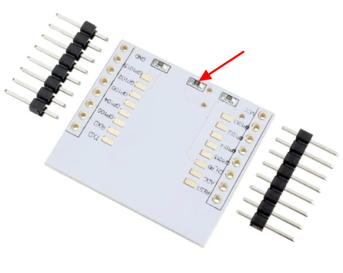
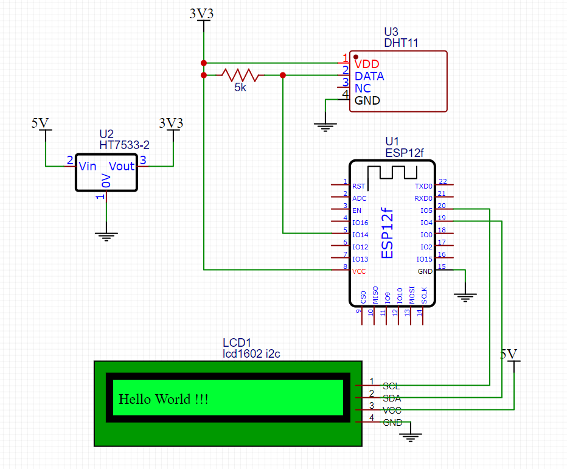

ESP12 Based Temperature Gauge
==================================

This is a hardware project I created for measuring the temperature and humidity of my 3D printer enclosure.
It is based on the ESP12 module and uses a DHT11 sensor.  The ESP12 is programmed using the Arduino IDE and the ESP8266 core.

## Hardware

The following hardware parts are listed with Amazon links, only to show what they look like.
You don't have to purchase them from Amazon.

- [ESP12f module](https://www.amazon.ca/dp/B07YYLQJGN) ([datasheet](doc/esp-12f_product_specification_en.pdf))
- [ESP8266 Programmer](https://www.amazon.ca/dp/B08BXMGVNM)
- [DHT11 sensor](https://www.amazon.ca/dp/B07DH7ZVMZ) ([datasheet](doc/DHT11-Technical-Data-Sheet-Translated-Version-1143054.pdf))
- [ESP12f breakout board](https://www.amazon.ca/dp/B0C1N2R49Z)
- [HT7533 voltage regulator](https://www.amazon.ca/dp/B09PBL3HVB) ([datasheet](doc/HT75xx-3v140.pdf))
- [LCD1602 with I2C](https://www.amazon.ca/dp/B07S7PJYM6)
- 5K resistor

The making of this project also contains a lot of trial and error,
so the STL files, programs, circuit schematics and PCB layout are provided ONLY for your reference.
Do not use them directly.

### About the parts

#### ESP12f

ESP12f is a variation of the ESP8266 module. The main reason I chose it is the cost.
It's very cheap and provide just enough GPIO pins for my project.
Even though the WiFi feature is not used, it is still cheaper than an Arduino Nano.

Regarding why choosing ESP12f module instead of other ESP8266 dev kit is because of its size.
With a breakout board, I can easily make the PCB the same size as the LCD1602 module,
and hide it behind the LCD1602, so that the final product is very compact.

The downside of using ESP12f is that it requires a programmer to program it.
For the same reason, once the module is soldered to the breakout board,
it won't be easy to remove it for reprogramming. But since my Arduino Nano is very simple, this is not a problem.

Alternatively, you can use [D1 mini](https://www.amazon.ca/dp/B09H6K2JQY).
Without soldering the pins, it has almost the same size as the ESP12f breakout board.
It has a USB port, so you don't need a programmer to program it.
You can also reprogram it easily, so no worry to make mistakes.
And it's price is nearly the same as the ESP12f module.
(Note that D1 mini renames the GPIO pins, so you need to refer to the [pin mapping](doc/pin-mapping.png) when connecting wires.)

#### ESP8266 breakout board

If you decide to use the ESP8266 breakout board, there's one thing you need to pay attention to.
The breakout board has space for an HT7533 voltage regulator, but it's not soldered by default.
If you want to install an HT7533, **DO REMOVE** the 0-ohm resistor R2 (as shown in the picture below).
This 0-ohm resistor shorts the input and output of the voltage regulator. If not removed, the 5V power will be shorted to the 3V3 input of ESP12f and will damage the module.

#### DHT11

DHT11 is less accurate than DHT22, but it's cheaper and smaller, and is good enough for my project.

### Schematic

Note that the ESP12f, DHT11 requires 3V3 power supply, while the LCD1602 requires 5V power supply.

### Assembly

See [photo](photo) directory for the photos of the assembly.

## Software

The software is written in C++ and uses the Arduino IDE with the ESP8266 core.

The [program](esp12-temperature-gauge.ino) is very straightforward ans self-explained.

### Libraries

- [DHT Sensor library](https://www.arduino.cc/reference/en/libraries/dht-sensor-library/)
- [LiquidCrystal I2C](https://www.arduino.cc/reference/en/libraries/liquidcrystal-i2c/)

## STL

See [STL](stl) directory. Note these files are not intened to be printed directly; many trial and error are involved.
