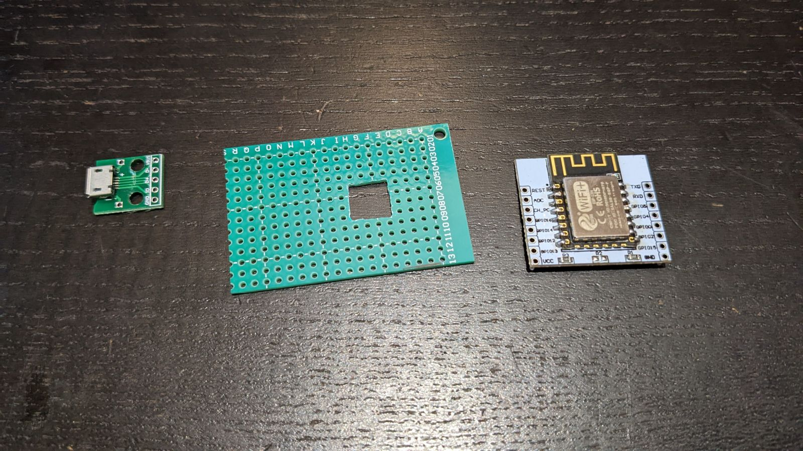
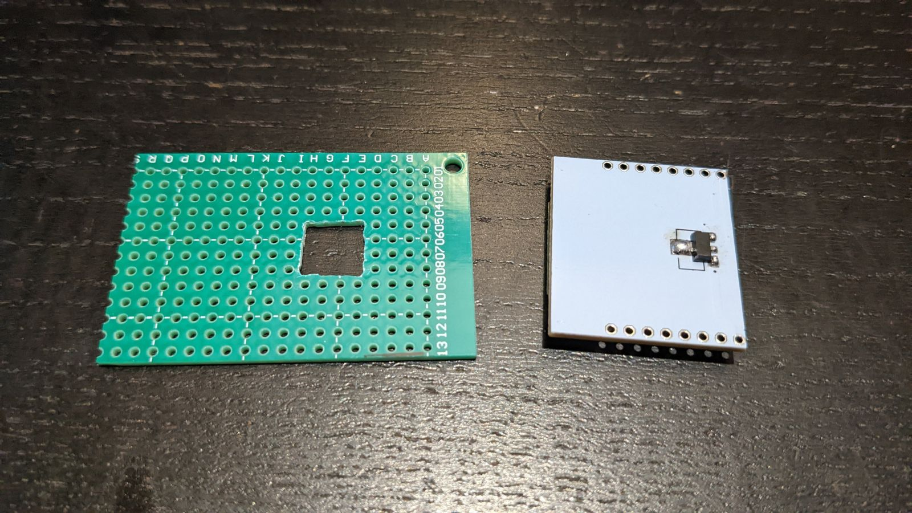
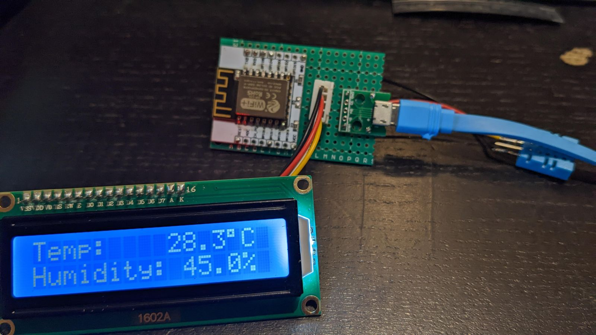
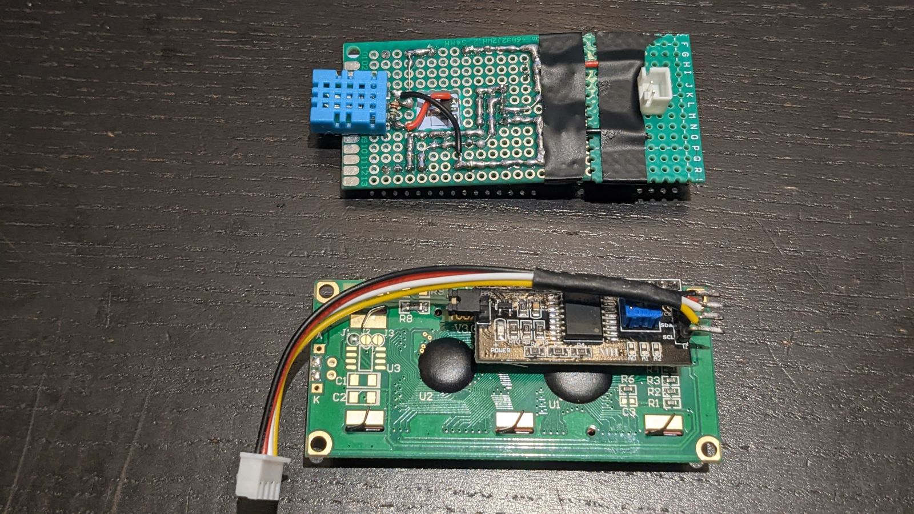
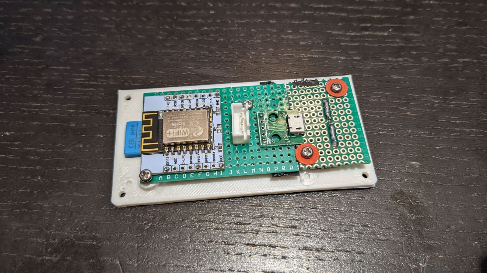
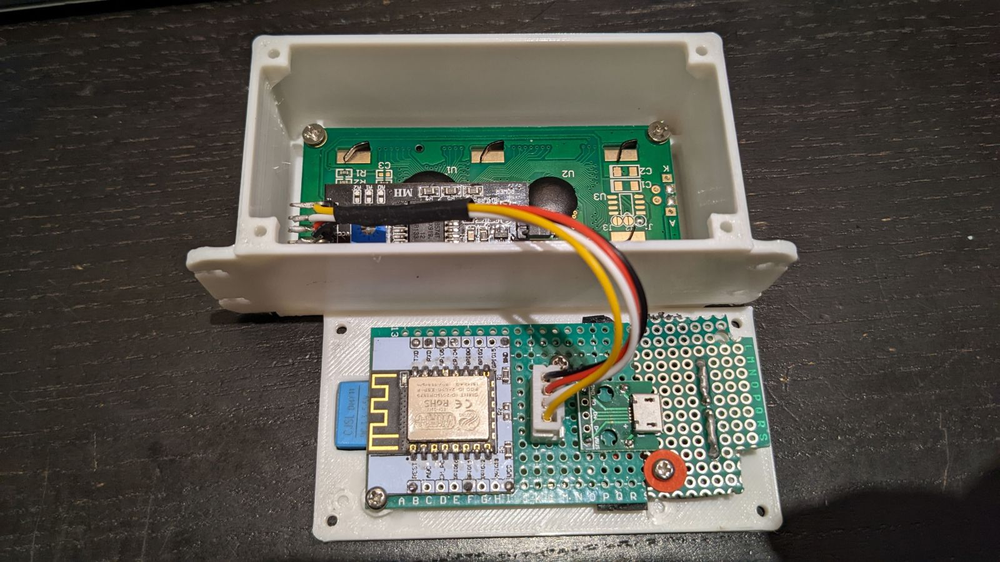
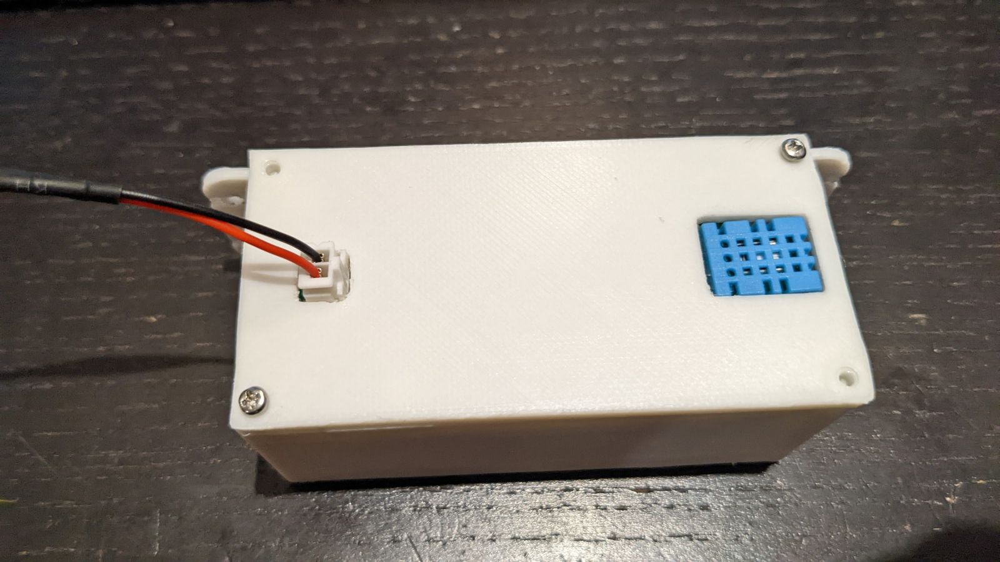
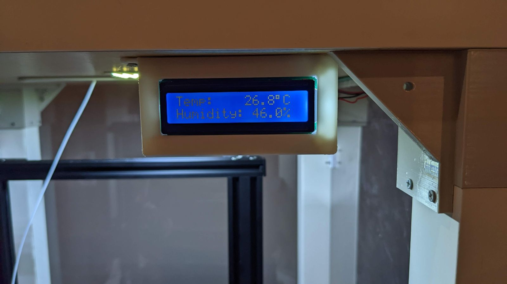

ESP12 Temperature Gauge
=========================

The ESP12 module soldered to the breakout board, the perfboard for holding everything, and a micro-USB breakboard for testing.
I drilled a square hole at the center of the perfboard to make space for the HT7533 voltage regulator soldered on the back of the breakout board.

Note that the 0-ohm resistor R2 on the breakboard is removed.

The other side. 

Added a DHT11 connector, and a micro-USB connector for testing.

The DHT11 module is installed. Note that the pin2 (data) is connected to pin1(Vin) through a 5k pull-up resistor.

Also another piece of perfboard is added to hold the 5V power connector. Two wires (behind the black tape) are used to connect the two perfboards.

Install on the backboard.

LCD1602 display installed in the enclosure.

Looks pretty clean.

The final product.

